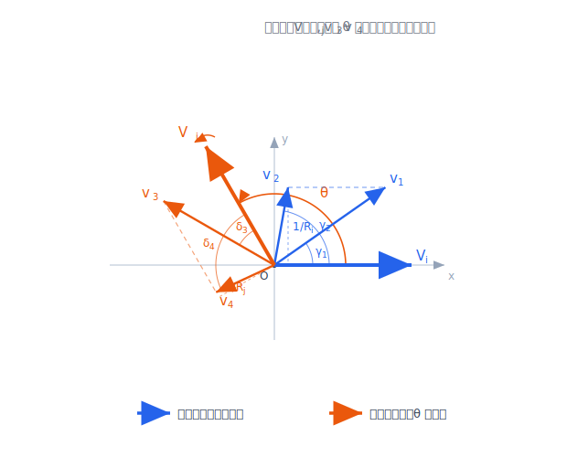

# 二体構築の相性・完全版 ― 実質一択まで込みのゲームの値と、相手構築を回したときのグラフ

## はじめに

皆さん、ぴら〜ん。最近チャンピオンズできずにポケモン界隈名乗って良いか不安になりつつあるぴらんです。

このシリーズでは「ポケモン単体同士の相性がわかっているとき、2匹で組んだ構築同士の相性はどうなるか？」を、数式でモデル化して遊んでいます。今回はその続きものなのですが——過去の記事を読んでいなくても大丈夫なように書きます。(離脱しないで〜〜)。 今回使う道具は次の章でぜんぶ定義から並べ直すので、ここでは「どういう経緯でこの話に行き着いたのか」だけ、軽くつかんでもらえればOKです。

その大前提として、このシリーズではポケモン1匹1匹の特徴（強さや、相手との相性）を**2次元のベクトル**で表すことにしています。「相性をベクトルで？」と引っかかるかもしれませんが、どう定義するのかは、次の章できちんと説明するのでそんなものなんだなと思っておいてください。

この単体ベクトルを使うと、前回は、2匹で組んだ構築同士の相性が、各構築から作れる $V$ という1本のベクトルだけでとてもシンプルな形に書ける、というところまで分かりました。ほくほくの結果だったんですが、ひとつだけサボっていた所があります。それは**2択公式の適用範囲外、つまり「実質一択」になる場合を「適用外」と言って放置していた**ことです。

その後、別の記事で2択ゲームのナッシュ均衡を、この「実質一択」の場合分けまで込みで完全に書き直しました。そこで今回はこの2つを合体させて、

1. **実質一択まで込みの構築同士のゲームの値**を単相性モデルの言葉で完全に書き下す
2. 構築同士の相対的な関係を見るために、片方の構築の $V$ を固定してもう片方を原点まわりに回転させ、**ゲームの値 $g$ が角度 $\theta$ とともにどう動くか（グラフの形）**を調べる

という2本立てでいきます。

……と、ここまで「前回」「別の記事」と過去記事の名前を連発しましたが、もう一度言っておくと、それらを読みに行かなくても今回の記事だけで完結するように書きます。「$V$ って何？」「2択公式って？」「実質一択って？」というあたりは、次の章で必要な分だけ定義からまとめ直すので、はじめましての人も安心してそのまま読み進めてください。もっと深掘りしたい人向けに、元記事のリンクだけ置いておきます。

- 1種類の相性からなるゲームのナッシュ均衡（単相性モデルの大元）：[https://mathlog.info/articles/nUfVU11ScwtIwsLsIQoB](https://mathlog.info/articles/nUfVU11ScwtIwsLsIQoB)
- 二体構築から一体選ぶゲームの相性関係：[https://mathlog.info/articles/JKJaLYZonc2XSVrdaNXL](https://mathlog.info/articles/JKJaLYZonc2XSVrdaNXL)
- 二択ゲームのナッシュ均衡：[https://note.com/pyran19/n/n9e2dc2e577d2](https://note.com/pyran19/n/n9e2dc2e577d2)

## 今回使う道具のまとめ（はじめての人はここだけ読めばOK）

ここが「前提を全部そろえる」章です。過去記事の中身を覚えていなくても、ここで並べる3つの道具——**単相性モデル**・**2択公式**・**構築ベクトル $V$**——だけ受け取ってもらえれば、後の計算はぜんぶ追えます。逆に言えば、ここさえ読めば過去記事に飛ぶ必要はありません。すでに読んでくれている人は復習として流し読みでどうぞ。

### 単相性モデル

ポケモン $i,j$ の相性を次の行列で表します。正なら $i$ 有利、負なら $j$ 有利。

$$
A_{ij}=p_i-p_j+x_iy_j-y_ix_j=p_i-p_j+v_i\times v_j
$$

$p$ がパワー、$v=(x,y)$ が相性ベクトル、$v_i\times v_j=x_iy_j-y_ix_j$ は2次元の外積（行列式）です。……と記号だけ並べても「なんで相性がベクトルの外積で書けるの？」となると思うので、各パーツが何を言いたいのか日本語でほぐしておきます。

$A_{ij}$ は「$i$ が $j$ に対してどれくらい有利か」（勝率から $1/2$ を引いて、対等を $0$ に合わせた値）でした。ポイントは、これが**パワー差** $p_i-p_j$ と**相性** $v_i\times v_j$ という、性質のちがう2つの足し算でできていることです。

ひとつめの**パワー $p$ は「相手が誰だろうと勝率を底上げしてくれる地力」**。$A_{ij}=p_i-p_j+\cdots$ の形を見ると、$p_i$ が大きいポケモンは相手 $j$ が何であっても利得が一律に持ち上がります。つまり全員に対して平等に強い。種族値が高いとか強い特性/技を持ってるとか、「誰と当たっても腐らない強さ」がこれですね。

ふたつめの**相性 $v_i\times v_j$ は「相手との噛み合い」**、相手次第で有利にも不利にもなる相対的な部分を担当します。外積は $v_i\times v_j=|v_i|\,|v_j|\sin\varphi$（$\varphi$ は $v_i$ から $v_j$ へ測った角度）と書けるので、相手のベクトルが自分から見て都合の良い向きにいれば $\sin\varphi>0$ で有利、逆向きなら不利。じゃんけんで「相手がチョキ寄りならグーの自分が強い」みたいな、向き合わせの有利不利です。ある向きの相手に強ければ、ちょうど反対を向いた相手には同じだけ弱い（$\sin$ の符号がひっくり返る）という釣り合いも、外積が勝手に表現してくれます。

ここで相性ベクトルは、向きと大きさで役割が分かれています。向き（偏角）は「どの相手と噛み合うか」というキャラの色を、大きさ $|v|$ は**「相性の影響の受けやすさ」**を表します。$|v|$ が大きいキャラは、ハマれば大勝ち・ハマらなければ大負けの相性ゲーが激しいタイプ、小さいキャラは相手を選ばない安定型です。これはパワーが高いのとは別の概念だというのは注意しておきます。

その上で今回は、**パワーが揃った構築同士、つまり等パワー**に絞ります。理由はシンプルで、パワーが高いほうが強いのは当たり前——$p_i-p_j$ が大きいほど有利、で話が終わってしまうからです。面白いのは $p$ で差がつかないときに残る相性の駆け引きのほうなので、今回はそこだけを取り出したい。等パワーなら $p_i-p_j=0$ で消えて、相性は外積項 $v_i\times v_j$ だけで決まります（パワー差を吸収する補正ベクトル $U$ は前回扱ったので今回はお休み）。

### 2択ゲームの値の公式（実質一択まで込み）

$2\times2$ の利得行列

$$
A=\begin{pmatrix} a & b \\ c & d \end{pmatrix}
$$

のゲームの値 $g$ は、実質一択の場合分けまで込めると次のようになります。

$$
g=\begin{cases}
\dfrac{ad-bc}{a+d-b-c} & (a-b)(c-d)<0\ かつ\ (a-c)(b-d)<0 \\[2mm]
a & c< a< b \\
b & d< b< a \\
c & a< c< d \\
d & b< d< c
\end{cases}
$$

1行目が「本質的に2択（混合戦略）」、残り4つが「実質一択」です。実質一択は、選択肢に差がありすぎて釣り合いを取るまでもなく片方を100%選ぶ状態で、ナナメに並んだ2要素の間に隣の要素が挟まると、その真ん中の要素がそのままゲームの値になります。

### 2匹構築 → ベクトル $V$

自分の構築を $\{1,2\}$、相手を $\{3,4\}$ とし、各自1匹を出して戦うゲームを考えます。利得行列は、行＝自分・列＝相手で

$$
A=\begin{pmatrix} a & b \\ c & d \end{pmatrix},\qquad
\begin{aligned}
a&=A_{13}=v_1\times v_3, & b&=A_{14}=v_1\times v_4,\\
c&=A_{23}=v_2\times v_3, & d&=A_{24}=v_2\times v_4
\end{aligned}
$$

と置きます（等パワーなので $p$ は消えています）。(引用する際に$b$ と $c$入れ替えたので前記事と比べるときは注意。中身は同じです。)これを2択公式に入れて整理すると、構築を表すベクトル

$$
V_i=\frac{v_1-v_2}{v_1\times v_2},\qquad V_j=\frac{v_3-v_4}{v_3\times v_4}
$$

を使って、本質的に2択の領域では $B_{ij}=\dfrac{1}{V_i\times V_j}$ になる、というのが前回の結論でした。

ちなみに $V_i$ は分母も外積なので、番号 $1\leftrightarrow2$ を入れ替えても分子・分母がそろって符号反転し、向き・大きさは変わりません。だから2匹のラベルは自由にとれて、一般性を失わず $v_1\times v_2>0$（$v_1\to v_2$ が反時計回り）と決めておけます（相手も $v_3\times v_4>0$）。以後はこの向きで揃えます。

## 実質一択まで込みの構築同士のゲームの値

ここからが今回の合体パートです。$a,b,c,d$ にそのまま構築の値を入れて、本質的に2択の領域では値が $\dfrac{ad-bc}{a+d-b-c}=\dfrac{1}{V_i\times V_j}$ になること（前回の結論）も合わせると、構築同士のゲームの値は

$$
g=\begin{cases}
\dfrac{1}{V_i\times V_j} & (a-b)(c-d)<0\ かつ\ (a-c)(b-d)<0 \\[2mm]
a=v_1\times v_3 & c< a< b \\
b=v_1\times v_4 & d< b< a \\
c=v_2\times v_3 & a< c< d \\
d=v_2\times v_4 & b< d< c
\end{cases}
$$

になります。覚え方はシンプルで、**$g$ は「自分の行で最小かつ相手の列で最大」になっている成分（鞍点＝ミニマックス点）**。そういう成分がなければ混合戦略の値 $\frac{1}{V_i\times V_j}$ を取る、という構造です。実質一択のときの $g$ は、結局実際に出される2匹の単体相性 $v_a\times v_b$ そのものになります。

### 条件をベクトルの外積で書く

場合分けを決めているのは次の4つの差の符号です。等パワーだと

$$
a-b=v_1\times(v_3-v_4),\quad c-d=v_2\times(v_3-v_4),\quad
a-c=(v_1-v_2)\times v_3,\quad b-d=(v_1-v_2)\times v_4
$$

で、$v_1-v_2=(v_1\times v_2)V_i$、$v_3-v_4=(v_3\times v_4)V_j$ を使うと（$v_1\times v_2>0,\ v_3\times v_4>0$ にとっておくと）符号は次のように $V$ と単体ベクトルの外積で書けます。

$$
\mathrm{sgn}(a-b)=\mathrm{sgn}(v_1\times V_j),\quad
\mathrm{sgn}(c-d)=\mathrm{sgn}(v_2\times V_j),\quad
\mathrm{sgn}(a-c)=\mathrm{sgn}(V_i\times v_3),\quad
\mathrm{sgn}(b-d)=\mathrm{sgn}(V_i\times v_4)
$$

本質的に2択になる条件は「**両構築が互いの相方ベクトルで挟まれる**」と読めます。

$$
\underbrace{(a-b)(c-d)<0}_{v_1,v_2\ が\ V_j\ の左右両側}\qquad かつ \qquad
\underbrace{(a-c)(b-d)<0}_{v_3,v_4\ が\ V_i\ の左右両側}
$$

つまり、相手の2匹が自分の $V_i$ をまたぐように開いていて、かつ自分の2匹が相手の $V_j$ をまたいでいるときだけ、ちゃんと読み合いの2択になります。どちらかが片側に寄ると、その瞬間に「片方に、相手のどちらに対しても有利な（出し得な）ポケモンがいる」状態＝実質一択に切り替わります。前回「適用外」として放置していた『2匹が近すぎる構築（タイプ統一など）』も、まさにこの片寄りが起きているケースで、今回は実質一択としてきちんと場合分けに収まります。

2択領域の中では、構築の特徴は $V_i$ だけで決まります。ですが、その2択と一択が切り替わる境界がどこに来るかは、実は $V_i,V_j$ だけでは決まらず、$v_1,\dots,v_4$ 個別の位置にもよるということが、上の条件からわかります。同じ $V$ を持つ構築でも、相手によっては2択で $\frac{1}{V_i\times V_j}$、別の相手では一択で別の値、ということが起こります。

## 相手構築を回してみる

さて、ここからが2本立ての後半です。構築2つを戦わせたときの有利不利は、$V_i$ と $V_j$ の相対的な位置関係——平たく言えば2本のベクトルの向きの差だけで決まります。「自分の構築が絶対的に強い／弱い」という話ではなく、相手が自分に対してどの向きで来るかで有利不利がコロコロ変わる、というのがこのモデルの肝です。

たとえば自分の構築はまったく同じでも、相手がたまたま自分にとって「有利な向き」に位置していれば勝ちやすいし、逆の向きに来れば苦しい。対戦でいう「相性」とか「噛み合い」みたいな、相手との位置取りの運の部分ですね。これを相手側をどれだけ回したかというパラメータ $\theta$ で表します。

そこで、自分の $V_i$ を固定したまま、相手の構築をぐるっと一周（$\theta$ を $0$ から $2\pi$ まで）回してみましょう。狙いは、$\theta$ に応じてゲームの値 $g$ がどれだけ・どんなふうに動くかを一枚の図で眺めること。こうすると、自分の構築が「どんな相手には強くて、どんな相手には弱いのか」、相性の地図のようなものが見えてきます。これが今回やりたいことです。

全体の回転対称性から $V_i$ を $x$ 軸正方向に固定できます（大きさ $R_i=|V_i|$）。相手は、自分の構築を剛体回転させると $V_j$ も同じだけ回るので、$V_j$ の向きを角度 $\theta$ として

$$
V_j=R_j(\cos\theta,\sin\theta)\qquad(R_j=|V_j|\ は一定)
$$

と書けます。$\theta$ だけが動く変数です。

$V_i$ の向きを $+x$ に固定すると、相方の $v_1,v_2$ は上半面に水平に並びます（$v_1$ が右）。相手側も $\theta=0$ では同じ並びで、そこから全体を角度 $\theta$ だけ回したものが一般の配置です。

この取り方のもとで、登場するベクトルの向き（偏角）を一覧にしておきます。自分の $v_1,v_2$ の偏角を $\gamma_1<\gamma_2$、相手の $v_3,v_4$ の（$\theta=0$ 基準の）偏角を $\delta_3<\delta_4$ とおきます（いずれも $(0,\pi)$ の中）。

| ベクトル | 向き（偏角） |
|---|---|
| $V_i$（自分の構築ベクトル） | $0$（$+x$ に固定・大きさ $R_i$） |
| $v_1,\ v_2$ | $\gamma_1,\ \gamma_2$ |
| $V_j$（相手の構築ベクトル） | $\theta$（大きさ $R_j$） |
| $v_3,\ v_4$ | $\delta_3+\theta,\ \delta_4+\theta$ |

$\theta$ を動かすと、相手側（$V_j,v_3,v_4$）がまとめて同じだけ回り、自分側は固定されたまま、というのがこの設定の見方です。

*配置の模式図：$V_i$ を $x$ 軸正方向に固定すると、相方 $v_1,v_2$ は高さ $1/R_i$ の水平線上に並ぶ（$v_1$ が右）。相手側は同じ図形をまるごと角度 $\theta$ だけ回したもので、$V_j$ が $\theta$、$v_3,v_4$ がその上に高さ $1/R_j$ で並ぶ。$\theta$ を回すと相手の三つ組だけがぐるっと回り、自分側は動かない。*

## グラフの特徴

### 2択領域での値

本質的に2択の領域では、ゲームの値は

$$
g=\frac{1}{V_i\times V_j}=\frac{1}{R_iR_j\sin\theta}
$$

です。これは分母に $\sin\theta$ が入った形、つまり $\sin\theta$ の逆数 $1/\sin\theta$ で、

- $\theta\in(0,\pi)$ で $g>0$（自分有利）、$\theta\in(\pi,2\pi)$ で $g<0$（相手有利）
- $|g|$ は $\theta=\tfrac{\pi}{2},\tfrac{3\pi}{2}$、つまり **$V_i\perp V_j$ のとき**（$\sin\theta=1$ と一番大きくなって、その逆数が一番小さくなるので）最小の $\dfrac{1}{R_iR_j}$

という性質を持ちます。**$V$ が平行に近いほど相性の影響が激しく、直交が一番安定**という、逆数ならではの効き方ですね。$\theta$ が $90^\circ$ から離れて $0,\pi$ に近づくほど $\sin\theta$ は小さくなり、その逆数である $g$ はどんどん大きくなります。式の上では $\theta\to0,\pi$ で $\sin\theta\to0$ になるので $g$ は発散してしまうのですが——ここが今回の一択になる条件まで考えた恩恵で、**その手前で必ず実質一択に切り替わるので、発散は実際には現れません**。

### 一択領域での値

実質一択のときの $g$ は4つの単体相性のどれか。外積は $v_i\times v_k=|v_i||v_k|\sin(\angle v_k-\angle v_i)$ なので、各ベクトルの偏角（$v_1,v_2$ が $\gamma_1,\gamma_2$、$v_3,v_4$ が $\theta+\delta_3,\theta+\delta_4$）を入れると、

$$
\begin{aligned}
a&=v_1\times v_3=|v_1||v_3|\sin(\theta+\delta_3-\gamma_1), & b&=v_1\times v_4=|v_1||v_4|\sin(\theta+\delta_4-\gamma_1),\\
c&=v_2\times v_3=|v_2||v_3|\sin(\theta+\delta_3-\gamma_2), & d&=v_2\times v_4=|v_2||v_4|\sin(\theta+\delta_4-\gamma_2)
\end{aligned}
$$

と、$\theta$ をずらした $\sin$ に長さを掛けた形になります。いずれも有界（$|a|\le|v_1||v_3|$ など）なので、これが「頭打ち」の正体です。

### 遷移角と2択の窓

場合の切り替わり（折れ目）が起きる $\theta$ は、上の符号がゼロになる所です。$\bmod\ \pi$ で

$$
\theta\equiv\gamma_1,\quad
\theta\equiv\gamma_2,\quad
\theta\equiv\pi-\delta_3,\quad
\theta\equiv\pi-\delta_4
$$

の4本（円周上では8本）で、前から順に $V_j$ が $v_1,v_2,\tilde v_3,\tilde v_4$ と平行になる角度です（$\tilde v_3,\tilde v_4$ は $v_3,v_4$ を $y$ 軸で反転した向き）。そして本質的に2択になるのは

$$
\boxed{\ \theta\bmod\pi\in(\gamma_1,\gamma_2)\cap(\pi-\delta_4,\ \pi-\delta_3)\ }
$$

のときだけです。これは $\theta=\tfrac{\pi}{2}$（と $\tfrac{3\pi}{2}$）まわりの「窓」で、**窓の幅は両構築の広がり $\gamma_2-\gamma_1$ と $\delta_4-\delta_3$ の小さい方**で決まります。窓の外（特に $\theta\approx0,\pi$、つまり $V_j\parallel\pm V_i$ 付近）は実質一択。だから $\sin\theta$ が $0$ に近づいて逆数が暴れ出す前に、一択化でガードされる、というわけです。

実質一択のとき「自分側に、相手がどちらを出してきても有利なポケモンがいる」のは $v_3,v_4$ が $V_i$ 軸の同じ側にいるとき、「相手側に、こちらのどちらに対しても有利なポケモンがいる」のは $v_1,v_2$ が $V_j$ の同じ側にいるとき。ざっくり、$\theta\approx0$（$V_j\parallel V_i$）では自分の一方のポケモンが、$\theta\approx\pi$ ではもう一方のポケモンが、相手のどちらに対しても有利（出し得）になる、という流れになります。

### 適当な値を入れてみる

具体的な角度と長さを決め打ちしてグラフを描いてみます。自分の2匹の偏角を $\gamma_1=60^\circ,\ \gamma_2=120^\circ$、相手の2匹の偏角を（$\theta=0$ の基準で）$\delta_3=40^\circ,\ \delta_4=140^\circ$、長さは4匹とも $1$ にします。こう取ると前係数 $|v_i||v_k|$ が $1$ になって値は純 $\sin$ になり、高さ $=\sin(\text{偏角})$ から $R_iR_j=\dfrac{1}{\sin60^\circ\sin40^\circ}\approx1.796$、2択の窓は $(60^\circ,120^\circ)$ と $(240^\circ,300^\circ)$ になり、場合分けは次のようになります。

| $\theta$ の範囲 | 領域 | ゲームの値 $g$ |
|---|---|---|
| $(320^\circ,\ 60^\circ)$ | 実質一択 | $a=\sin(\theta-20^\circ)$ |
| $(60^\circ,\ 120^\circ)$ | 本質的に2択 | $\dfrac{1}{1.796\,\sin\theta}$ |
| $(120^\circ,\ 220^\circ)$ | 実質一択 | $d=\sin(\theta+20^\circ)$ |
| $(220^\circ,\ 240^\circ)$ | 実質一択 | $b=\sin(\theta+80^\circ)$ |
| $(240^\circ,\ 300^\circ)$ | 本質的に2択 | $\dfrac{1}{1.796\,\sin\theta}$ |
| $(300^\circ,\ 320^\circ)$ | 実質一択 | $c=\sin(\theta-80^\circ)$ |

> 【挿入グラフ①：$\theta$–$g$ プロット（$\gamma_1,\gamma_2=60^\circ,120^\circ$、$\delta_3,\delta_4=40^\circ,140^\circ$、長さ $1$）】
> - 横軸：$\theta$（$0^\circ$〜$360^\circ$、$V_j$ の向き）
> - 縦軸：ゲームの値 $g$（$-1$〜$1$ 程度）
> - 本質的に2択の区間（$60$–$120^\circ$, $240$–$300^\circ$）を青、実質一択の区間を灰で色分け
> - グラフ下に「場合分けストリップ」：各 $\theta$ で $g$ がどの値（$a/b/c/d/$2択）かを帯で表示
> - 期待される形：$\theta=60^\circ,120^\circ$ で最大 $\approx0.64$、$\theta=220^\circ,320^\circ$ で最小 $\approx-0.87$、2択窓の中心 $\theta=90^\circ$ で局所的な極小 $\approx0.56$
> - （ツールに $\gamma_1,\gamma_2=60^\circ,120^\circ$、$\delta_3,\delta_4=40^\circ,140^\circ$、長さ $1$ を入れればこの図になります）

### グラフから読めること

このグラフから読めることを見てみましょう。

- **連続だが折れ目（微分不可能）がある**。8本の遷移角で $g$ の傾きがカクッと変わります。実質一択に切り替わった途端、どの成分がゲームの値を決めるかが入れ替わるためです。
- **2択窓の中心 $\theta=90^\circ$ でむしろ $g$ が極小**になります。窓の中では $\theta$ が $90^\circ$ から離れるほど $\sin\theta$ が小さくなる＝その逆数 $g$ が大きくなるので、最大の有利 $\approx0.64$ は窓の縁、つまり2択と一択の境目で達成されます。「直交が一番安定（＝有利不利が小さい）」がそのまま出ているわけですね。
- **一択化で頭打ちになる**。点線で $\sin$ の逆数の曲線をそのまま伸ばせばもっと跳ね上がりそうに見える所が、単体相性 $\sin$ の値で抑えられます。2択だけ見ると極端に強そうでも、実質一択まで込みで考えるとほどほどに収まる、というわけです。
- **発散は必ずガードされる**。窓の縁（遷移角）は $\gamma_1,\gamma_2,\pi-\delta_3,\pi-\delta_4$ で、どれも $(0^\circ,180^\circ)$ の内側＝ $\sin\theta\ne0$ の側にあります。これは対称配置に限らずいつでも成り立つので、$\sin\theta$ が $0$ に届く手前で必ず一択に切り替わり、逆数の発散は決して起きません。
- **$|g|\le1$ に収まるのは長さを $1$ に揃えたから**。一択側の値が $\sin$（$\le1$）で頭打ちになり、2択側もその縁の値（＝隣の一択値）を超えないので、この例では $|g|\le1$。具体的には窓の縁での値が $\cos50^\circ\approx0.64$、窓の底（$\theta=90^\circ$）の値が $\cos30^\circ\cos50^\circ\approx0.56$ になります（$30^\circ,50^\circ$ は各構築の広がり $\gamma_2-\gamma_1=60^\circ,\ \delta_4-\delta_3=100^\circ$ の半分）。
- **$g$ を大きく振らせるのは広がりではなく長さ $|v|$**。一択側の頭打ちは $|v_a||v_b|$ なので、相性の影響を受けやすい（$|v|$ が大きい）ポケモンが絡むと $|g|$ は $1$ を超えていきます。逆に広がり（$\gamma,\delta$ の開き）をいくら大きくしても、窓が $0^\circ,\pi$ に迫る分だけ $R_i,R_j$ も一緒に大きくなって打ち消すので、$g$ は頭打ちのまま大きくなりません。

> 【挿入グラフ②（任意）：広がり $\gamma_2-\gamma_1,\ \delta_4-\delta_3$ を変えた数枚の重ね描き、または2択の $\sin$ の逆数曲線（点線）と実際の $g$（実線）の対比】
> 「窓の幅が $\min(\gamma_2-\gamma_1,\ \delta_4-\delta_3)$ で決まる」「一択で頭打ちになる」を1枚で見せられます。インタラクティブ版（角度スライダー）でも可。

## まとめ

- **実質一択まで込みの2択公式**を単相性モデルの 2対2 に流し込んで、**場合分け込みの構築同士のゲームの値**を等パワーで完全に書きました。さらに $V_i$ を $+x$ 軸に固定して相手を $\theta$ だけ回した配置（$v_1,v_2$ の偏角を $\gamma_1,\gamma_2$、$v_3,v_4$ の $\theta=0$ 基準の偏角を $\delta_3,\delta_4$）に各値・各条件まで落とすと、$\theta$ の関数として

$$
g=\begin{cases}
\dfrac{1}{V_i\times V_j}=\dfrac{1}{R_iR_j\sin\theta} & \sin(\theta-\gamma_1)\sin(\theta-\gamma_2)<0\ かつ\ \sin(\theta+\delta_3)\sin(\theta+\delta_4)<0 \\[2mm]
v_1\times v_3=|v_1||v_3|\sin(\theta+\delta_3-\gamma_1) & \sin(\theta-\gamma_1)<0\ かつ\ \sin(\theta+\delta_3)>0 \\[2mm]
v_1\times v_4=|v_1||v_4|\sin(\theta+\delta_4-\gamma_1) & \sin(\theta-\gamma_1)>0\ かつ\ \sin(\theta+\delta_4)>0 \\[2mm]
v_2\times v_3=|v_2||v_3|\sin(\theta+\delta_3-\gamma_2) & \sin(\theta-\gamma_2)<0\ かつ\ \sin(\theta+\delta_3)<0 \\[2mm]
v_2\times v_4=|v_2||v_4|\sin(\theta+\delta_4-\gamma_2) & \sin(\theta-\gamma_2)>0\ かつ\ \sin(\theta+\delta_4)<0
\end{cases}
$$

となります（1行目の2択条件は窓 $\theta\bmod\pi\in(\gamma_1,\gamma_2)\cap(\pi-\delta_4,\pi-\delta_3)$ と同じ）。

- 本質的に2択になる条件は「両構築が互いの相方ベクトルで挟まれる」こと。$V$ だけで全部決まるのは2択領域の中だけで、一択への切り替わりは個別ベクトルにもよる、という但し書きも付きます。
- 相手構築を一周回したときの $g(\theta)$ は、2択領域での $g=\dfrac{1}{R_iR_j\sin\theta}$（$\sin$ の逆数曲線）と、その外側で単体相性 $v_a\times v_b$ に頭打ちする部分とを、遷移角でつないだ**連続だが折れ目のある曲線**になります。
- いちばん言いたいのは、この**頭打ち（一択化）が $\sin\theta$ の発散を必ずガードする**こと。窓の縁（遷移角）は配置によらず必ず $\sin\theta\ne0$ の側に来るので、$\sin\theta$ が $0$ に届いて逆数が暴れ出す前に一択へ切り替わり、$g$ は有限に収まります。しかも有利の最大は窓の縁（2択と一択の境目）で達成され、$V_i\perp V_j$ となる窓の中心がむしろ一番安定、という直感に反した形になりました。
- そして $g$ の振れ幅を決めるのは構築の広がりではなく**相性ベクトルの長さ $|v|$**。広がりをいくら開いても窓が $0,\pi$ に迫る分だけ $R_i,R_j$ が一緒に育って打ち消すので、$g$ を大きく振らせるのは「相性の影響を受けやすい（$|v|$ が大きい）ポケモンを絡めること」のほうだ、という構図が見えました。

## あとがき

いかがでしたか？ 前回まで「適用外」として放置していた実質一択をちゃんと書き切れて、ついでに相手を回したときのグラフの形まで眺められて満足です。二択のままだと分母の$\sin$ が０になるところが、途中で一択になってガードされてしまって有限値に収まる、というのが個人的にはお気に入りポイントでした。都合の良いところで一択にできるように工夫をすれば有利なθが増える=噛み合いに依らない構築づくりのヒントになりそうな予感がします。

今回は数式とサンプルのグラフまで。面白くなってくるのはこの先で、

- $\theta$ を $0$〜$2\pi$ まで積分して回転平均を取り、「平均的に有利／安定な構築の特徴」を引き出す
- 網羅的に$v_1,v_2$ の半径や角度を変えたときのグラフ列挙

あたりを次回じっくりやりたいと思っています。お楽しみに！ では次回～～
