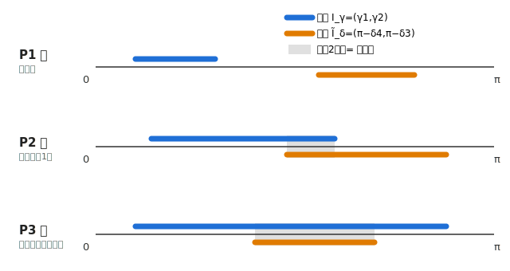
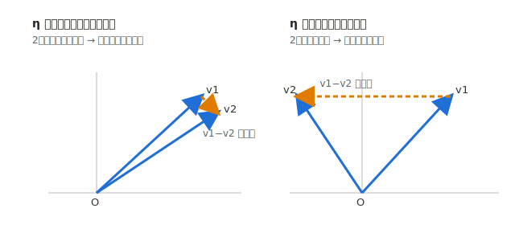

# 構築を一周回して“ならす”と何が残るか ― 相性グラフの3つの形と、回転平均が $S,\eta$ だけで決まる話

## 概要

「ポケモン2匹で組んだ構築同士の相性」を、相手をぐるっと一周回したときのゲームの値 $g(\theta)$ という曲線で眺める話です。今回はこの曲線が**配置によって3つの形（離・重・包）にしか分かれない**ことを見たうえで、$\theta$ を一周ぶん積分した**回転平均**を閉じた式で出します。結論はとても気持ちよくて、平均は

$$
\langle g\rangle=\frac{S_iS_j}{2\pi}\,(\eta_i-\eta_j)
$$

という、各構築の「長さの和 $S$」と「広がり効率 $\eta$」というたった2つの数だけで書けます。**広がり効率が相手より高い側が、噛み合い運をならせば勝つ**。読み合いの2択がどこに何個できても、平均には1ミリも効きません。

<!-- IMAGE:THUMBNAIL -->
> **【サムネイル / イメージ図 — 画像生成AI用プロンプト】**
> Prompt: "minimalist abstract illustration, two pairs of slender vectors fanning out from a single origin on a soft gradient field, one pair narrow and one pair wide open, faint circular orbit suggesting rotation, conceptual and clean, muted blue and amber palette, lots of negative space, no text"
> 補足: 正方形〜横長。静かで幾何的、文字なし。回転と「広がりの差」がふわっと伝わる方向で。
> （↓ ここに生成画像を挿入）
<!-- /IMAGE:THUMBNAIL -->

## はじめに

みなさん、ぴら〜ん。最近はランクマよりこの理論遊びのほうが楽しくなってきて、対戦勢を名乗っていいのか毎度不安になっているぴらんです。

このシリーズでは、ずっと「ポケモン単体同士の相性が分かっているとき、2匹で組んだ構築同士の相性はどうなるか？」を数式で遊んでいます。前に、片方の構築を固定してもう片方を原点まわりにぐるっと回し、**ゲームの値 $g$ が回転角 $\theta$ とともにどう動くか**というグラフを描くところまでやりました。「自分の構築は、どんな向きの相手には強くて、どんな向きには弱いのか」という相性の地図ですね。

今回はその地図をもう一歩進めて、次の2つをやります。

1. この $g(\theta)$ のグラフが、配置によって**たった3つの形（離・重・包）**にしか分かれないことを見る
2. $\theta$ を $0$ から $2\pi$ まで一周ぶん積分して**回転平均**を取り、「噛み合い運をならしたとき、平均的に強い構築とは何か」を一本の式で取り出す

——と、ここで「前にも似た記事書いてなかった？」と思った方。鋭いです。前回は $g(\theta)$ の式と1個のサンプルグラフまででした。今回はそこから先、**あらゆる配置でのグラフの形の分類**と、**一周平均という新しい量**が主役です。そして大事なこととして、**前回を読んでいなくてもこの記事だけで完結する**ように、次の章で道具を全部定義から並べ直します。はじめましての人も安心してそのままどうぞ。深掘りしたい人向けに元記事だけ置いておきます。

- 二択ゲームのナッシュ均衡（実質一択まで込み）：[https://note.com/pyran19/n/n9e2dc2e577d2](https://note.com/pyran19/n/n9e2dc2e577d2)
- 二体構築から一体選ぶゲームの相性関係（構築ベクトル $V$ の導入）：[https://mathlog.info/articles/JKJaLYZonc2XSVrdaNXL](https://mathlog.info/articles/JKJaLYZonc2XSVrdaNXL)
- 相手を回したときのグラフ $g(\theta)$（前回・今回の直前）：（投稿先URL）

## 今回使う道具のまとめ（はじめての人はここだけ読めばOK）

ここで前提を全部そろえます。過去記事の中身を覚えていなくても、この章の**単相性モデル**・**構築ベクトル $V$**・**相手を回す設定**の3つだけ受け取ってもらえれば、後の話は全部追えます。すでに読んでくれている人は復習として流し読みでどうぞ。

### 単相性モデルと等パワーの約束

ポケモン $i,j$ の相性（$i$ から見た有利さ。勝率から $1/2$ 引いて対等を $0$ にした量）を、次の形で表します。

$$
A_{ij}=p_i-p_j+v_i\times v_j
$$

$p$ が**パワー**（相手が誰でも勝率を底上げする地力）、$v=(x,y)$ が**相性ベクトル**、$v_i\times v_j=x_iy_j-y_ix_j$ は2次元の外積です。外積は $v_i\times v_j=|v_i||v_j|\sin\varphi$（$\varphi$ は $v_i$ から $v_j$ への角度）と書けるので、相手が自分から見て都合の良い向きにいれば有利、逆向きなら不利、という**向き合わせの噛み合い**を表します。

ベクトルの**向き**は「どの相手と噛み合うか」というキャラの色、**長さ $|v|$** は「相性の影響の受けやすさ」で、長いほどハマれば大勝ち・外せば大負けの振れ幅が大きいタイプ。これはパワー $p$ とは別の軸であることに注意です。

今回は**等パワー**（$p_i=p_j$）に絞ります。パワーで差がつくなら高い方が強いに決まっていて面白くないので、$p_i-p_j=0$ で消して、相性 $v_i\times v_j$ の駆け引きだけを取り出します。

### 2匹構築 → 構築ベクトル $V$

自分の構築を $\{1,2\}$、相手を $\{3,4\}$ とし、各自1匹を選んで戦うゲームを考えます。利得行列は等パワーなので外積だけで

$$
A=\begin{pmatrix} v_1\times v_3 & v_1\times v_4 \\ v_2\times v_3 & v_2\times v_4 \end{pmatrix}.
$$

これを2×2ゲームの値の公式（混合戦略の鞍点を取るやつ）に入れて整理すると、過去記事の結論として、各構築を表す1本のベクトル

$$
V_i=\frac{v_1-v_2}{v_1\times v_2},\qquad V_j=\frac{v_3-v_4}{v_3\times v_4}
$$

が出てきて、**本質的に2択（両者が混ぜ合う読み合い）になる領域では**、ゲームの値が

$$
g=\frac{1}{V_i\times V_j}
$$

というシンプルな形になります。「構築の特徴が $V$ 一本に詰まっている」というのがこのモデルの気持ちいいところです。$V_i$ は番号 $1\leftrightarrow2$ を入れ替えても向き・大きさが変わらないので、一般性を失わず $v_1\times v_2>0,\ v_3\times v_4>0$（反時計回り）に揃えておきます。

ただし2択公式には適用範囲があって、選択肢に差がつきすぎると片方を100%選ぶ**「実質一択」**に切り替わります。そのときのゲームの値は、実際に出る2匹の単体相性 $v_a\times v_b$ そのものです。前回はこの一択まで込みで $g$ を完全に書きました。今回は**そこは結果だけ使います**：

$$
g=\begin{cases}
\dfrac{1}{V_i\times V_j} & \text{両構築が互いの相方ベクトルで挟まれているとき（本質的に2択）}\\[2mm]
v_a\times v_b & \text{片方に「相手のどちらにも有利な出し得」がいるとき（実質一択）}
\end{cases}
$$

ざっくり、**自分の行で最小・相手の列で最大になる成分（鞍点）があればそれが $g$、なければ混合戦略の値 $\frac{1}{V_i\times V_j}$**、という構造です。

### 相手を回す設定（$\theta$、$\gamma$、$\delta$）

構築同士の有利不利は、$V_i$ と $V_j$ の**向きの差**だけで決まります。自分が絶対的に強い／弱いという話ではなく、相手が自分に対してどの向きで来るかでコロコロ変わる。この「相手との位置取りの運」を、相手をどれだけ回したかというパラメータ $\theta$ で表します。

全体の回転対称性を使って、自分の $V_i$ を $x$ 軸正方向に固定します（大きさ $R_i=|V_i|$）。相手は構築まるごと角度 $\theta$ だけ回るので、

$$
V_j=R_j(\cos\theta,\sin\theta)\qquad(R_j=|V_j|\ は一定)
$$

と書けて、$\theta$ だけが動く変数になります。登場するベクトルの向き（偏角）は次の通り。自分の相方 $v_1,v_2$ の偏角を $\gamma_1<\gamma_2\in(0,\pi)$、相手の $v_3,v_4$ の（$\theta=0$ 基準の）偏角を $\delta_3<\delta_4\in(0,\pi)$ とおきます。

| ベクトル | 向き（偏角） |
|---|---|
| $V_i$（自分の構築ベクトル） | $0$（$+x$ に固定・大きさ $R_i$） |
| $v_1,\ v_2$ | $\gamma_1,\ \gamma_2$ |
| $V_j$（相手の構築ベクトル） | $\theta$（大きさ $R_j$） |
| $v_3,\ v_4$ | $\delta_3+\theta,\ \delta_4+\theta$ |

$\theta$ を回すと相手側（$V_j,v_3,v_4$）だけがまとめて回り、自分側は動かない、という見方です。前回はこの設定で、$g(\theta)$ が「2択域では $\frac{1}{R_iR_j\sin\theta}$（$\sin$ の逆数のU字）、その外で単体相性 $\sin$ に頭打ち」する、**連続だけど折れ目のある曲線**になることを見ました。今回はここからスタートします。

## グラフの形は2つの区間の重なり方で決まる

さて本題です。$g(\theta)$ のグラフ、配置（$\gamma,\delta$ や長さ）をいじると形が変わるわけですが——実は**変わり方は3パターンしかありません**。なぜか。

グラフの形（どこで2択になり、どこで一択になるか）を決めているのは、弧の切り替わる**遷移角**だけです。これは $\theta\equiv\gamma_1,\gamma_2,\pi-\delta_3,\pi-\delta_4\ (\bmod\pi)$ の4本しかありません。そして本質的に2択になる「窓」は、$(0,\pi)$ 上の2つの区間

$$
I_\gamma=(\gamma_1,\ \gamma_2),\qquad
\tilde I_\delta=(\pi-\delta_4,\ \pi-\delta_3)
$$

の**重なり** $I_\gamma\cap\tilde I_\delta$ です（$\tilde I_\delta$ は相手の $v_3,v_4$ を $y$ 軸で反転した向きの区間。2匹が等長の対称配置ならちょうど $\tilde I_\delta=(\delta_3,\delta_4)$）。つまり**グラフの形は、自分の区間 $I_\gamma$ と相手の区間 $\tilde I_\delta$ がどう重なっているかだけで決まる**。長さは弧の区切りには効かず、値の高さにだけ効きます。

2つの区間（どちらも $\gamma_1<\gamma_2$、$\delta_3<\delta_4$ で向きは固定）の並び方は、敵味方の入れ替えを除けば次の3つで尽きます。

<!-- FIGURE:SVG id="fig-pattern" P1/P2/P3＝2区間の重なり方の模式図 -->

*自分の区間 $I_\gamma$（青）と相手の区間 $\tilde I_\delta$（橙）を $(0,\pi)$ 上に並べたもの。重なり（灰）が読み合いの「窓」。離れていれば窓なし（P1）、端で食い違えば窓が1つ（P2）、片方が片方を含めば細い方まるごとが窓（P3）。*

### P1：離（窓なし・全域が一択）

2区間が離れて重ならず、**読み合いの窓が一周どこにも開かない**パターン。$g(\theta)$ は4本の正弦の弧を滑らかにつないだ**有界でなめらかな波**になり、$\sin\theta$ の逆数の尖りはどこにも出ません。最もおとなしいグラフです。2匹の広がりが狭いか、左右にズレて区間が離れているときに起きます。

### P2：重（部分的に重なる・窓が端に1つ）

2区間が**端で食い違って重なる**パターン。重なった所が窓（と、その $\pi$ 反対側にもう1つ）。窓の中は $\frac{1}{R_iR_j\sin\theta}$ のU字の谷で、谷底で最小、両縁で一択の山と滑らかにつながります。**「片側の山を登り切る手前で2択の谷へ落ち、また反対の山へ」**がP2の顔つき。重なりが端寄りなのでグラフは左右非対称です。

### P3：包（片方が片方を含む・窓は狭い方の幅いっぱい）

細い区間が太い区間に**すっぽり入る**パターン。窓は細い方の区間まるごとで、その両側に太い方の余り幅ぶんの一択の弧が張り出します。2匹を等長に置いた対称配置はいつもこのP3で、前回のサンプルグラフ（$\gamma=60^\circ,120^\circ$／$\delta=40^\circ,140^\circ$）もこれにあたります。窓が $\theta=\tfrac\pi2$ に据わり、グラフが一番左右対称に近い形です。

> 残り3パターン（自分と相手の役割を入れ替えたもの）は、敵味方交換 $g_{\text{swap}}(\theta)=-g(-\theta)$ で P1〜P3 から移れるので、この3つを書けば全部を尽くします。

数値でも、相手側を $\tilde I_\delta=(70^\circ,110^\circ)$ に固定して自分の区間だけ動かすと、$I_\gamma=(20^\circ,60^\circ)$ で**窓なし＝P1**、$I_\gamma=(50^\circ,90^\circ)$ で重なり $(70^\circ,90^\circ)$ の**P2**、$I_\gamma=(60^\circ,120^\circ)$ で $\tilde I_\delta$ 全体を飲み込む**P3**、ときれいに移り変わります（`tools/rotating-team/` の計算で確認済み。同高さ縛りで長さを揃えるのを忘れずに）。

## 各領域の値を $S,\eta,\alpha$ で書き直す

ここで、後の回転平均と地続きにするために、生の $\gamma,\delta,$ 長さではなく**チームごとの3つのスカラー**でグラフを語り直しておきます。各チームは正味3自由度（4成分のうち全体回転の1つが落ちる）なので、ちょうど次の3つに分かれます。

$$
\boxed{\
S=|v_a|+|v_b|\ (\text{長さの和}),\quad
\eta=\frac{|v_a-v_b|}{S}\ (\text{広がり効率}),\quad
\alpha=\frac{|v_a|-|v_b|}{S}\ (\text{長さの非対称})\
}
$$

$\eta$ は2匹のベクトル差を、$\alpha$ は2匹の長さ差を、同じ $S$ で割った無次元量です。逆三角不等式から $|\alpha|\le\eta$。$\alpha=0$ が等長 $|v_1|=|v_2|$（対称配置）です。

これらで $g$ の各領域を書き直すと、**全領域に共通の縦スケール $\frac{S_iS_j}{4}$ がくくり出せて**、残りが $\eta,\alpha$ の形になります（`tools/rotating-team/` で機械精度の一致を確認済み）。一択の4本の弧は

$$
\frac{S_iS_j}{4}\,(1\pm\alpha_i)(1\pm\alpha_j)\,\sin(\theta+\cdots),
$$

2択の床（$\theta=\tfrac\pi2$ での値）や遷移角 $\cos\gamma_1=\frac{\eta_i^2+\alpha_i}{\eta_i(1+\alpha_i)}$ なども全部 $\eta,\alpha$ で閉じます。式の係数がそのまま意味に対応していて：

- **$S$＝縦スケール。** 一択の山も2択の谷も丸ごと $\frac{S_iS_j}{4}$ に比例。$S$ を上げるとグラフが縦に相似拡大するだけで、形・窓・パターンは一切変わりません。
- **$\eta$＝遷移角（弧の境界）の開き。** $\eta_i$ を上げると自分の区間 $(\gamma_1,\gamma_2)$ の両端が $0$ と $\pi$ へ外へ開きます。一択の高さには $\eta$ は入らない（広げても頭打ちの高さは変わらない）ので、$\eta$ が効くのは**境界の移動を通してだけ**。
- **$\alpha$＝一択の高さ配分と左右の傾き。** $\alpha_i>0$（$v_1$ が長い）だと $v_1$ 側の山が高く $v_2$ 側が低くなって、グラフが左右に傾きます。

そして**どのパターン（P1/P2/P3）になるかは区間の重なり方＝ $\eta$（幅）と $\alpha$（中心）だけで決まり、$S$ は効かない**。$\eta$ を上げて幅を広げるか $\alpha$ を $0$ に寄せて中心を揃えると、P1→P2→P3 と窓が育っていきます。この「$S$ で縦に伸び、$\eta$ で境界が開き、$\alpha$ で傾く」という対応は、次の回転平均で「何が平均に効くか」を読むときに効いてきます。

## 回転平均 ― 一周ならすと何が残るか

いよいよ今回の山場です。相手を一周回したときのゲームの値を**ならして**みましょう。つまり

$$
\langle g\rangle=\frac{1}{2\pi}\int_0^{2\pi} g(\theta)\,d\theta
$$

を計算します。これは「相手がどの向きで来るか分からない（一様にランダム）とき、平均してどれだけ有利か」を表す量です。噛み合い運を均してしまったあとに残る、構築の素の強さですね。

### 2択の窓は平均にまったく効かない

まず気持ちいい事実から。**読み合いの2択がどこに何個できても、回転平均には1ミリも寄与しません。**

理由はこうです。窓はいつも**$\pi$ 反対側にペアで現れます**（P2・P3の表を見ると、第2窓は第1窓のちょうど $+\pi$）。そして2択の値は $\frac{1}{R_iR_j\sin\theta}$ で、$\sin(\theta+\pi)=-\sin\theta$ だから

$$
\int_{\text{窓2}}\frac{d\theta}{R_iR_j\sin\theta}=-\int_{\text{窓1}}\frac{d\theta}{R_iR_j\sin\theta},
$$

**上下の窓の寄与が厳密に相殺してゼロ**。一周ならすと、効くのは**一択の弧だけ**になります。前回「二択部分は上に偏る寄与をほとんど持たない」と目で見て言っていたことの、積分での裏付けですね。読み合いの取り分は、有利側の半周だけ見れば残るのですが（おまけ参照）、一周では下半分の窓と打ち消し合って消えます。

### 一周平均の閉じた式

残った一択の4本の弧を足します。各弧は $\int L\sin(\theta+\varphi)\,d\theta=-L\cos(\theta+\varphi)$ で素直に積分できて、$\cos\gamma,\cos\delta$ ごとにくくり直すと——途中は気合で整理しますが——**配置パターン（P1/P2/P3）によらず同じ1本の式**になります。

$$
\boxed{\;\int_0^{2\pi}\! g\,d\theta
=(|v_3|+|v_4|)\,|v_1-v_2|\;-\;(|v_1|+|v_2|)\,|v_3-v_4|\;}
$$

ここで $|v_a|\cos(\text{偏角})$ が単体ベクトルの $V_i$ 軸方向成分で、同高さの2匹では $|v_1|\cos\gamma_1-|v_2|\cos\gamma_2=|v_1-v_2|$ となること（差ベクトルが $V_i$ と平行）を使っています。日本語にすると、

> **自分の相方の引き離し $|v_1-v_2|$ を、相手の長さの和 $(|v_3|+|v_4|)$ で重み付けしたもの。そこから、相手の引き離しを自分の長さの和で重み付けしたものを引く。**

という、自分と相手がきれいに対になった形です。

### $S$ と広がり効率 $\eta$ だけで書ける

ここで先ほどの $S=|v_a|+|v_b|$ と、もうひとつ**広がり効率**

$$
\boxed{\ \eta=\frac{|v_a-v_b|}{|v_a|+|v_b|}\in[0,1]\ }
$$

を使うと、上の式は $|v_1-v_2|=S_i\eta_i$、$|v_3-v_4|=S_j\eta_j$ と置き換わって、回転平均が

$$
\boxed{\ \langle g\rangle=\frac{S_iS_j}{2\pi}\,(\eta_i-\eta_j)\ }
$$

という、**たった2つの数 $S,\eta$ だけ**の式に畳まれます（`tools/rotating-team/` の数値積分と機械精度で一致を確認済み）。あれだけ場合分けして書いたグラフが、一周ならすと指標2つに圧縮されるの、ちょっと感動しませんか。

$\eta$ は「2匹の相方をどれだけ引き離せているか」の正規化済みの指標です。$\eta\to0$ が2匹ほぼ同方向（相方が冗長で意味が薄い）、$\eta\to1$ が反平行（最大に広く張れている）。等長なら $\eta=\sin(\phi/2)$（$\phi$ は2匹の開き角）で、要するに「開き角の半分の $\sin$」です。

<!-- FIGURE:SVG id="fig-eta" 広がり効率 η の大小（相方の引き離し）の概念図 -->

*広がり効率 $\eta=|v_1-v_2|/(|v_1|+|v_2|)$。左：2匹が同じ向きだと差ベクトルが短く $\eta$ が小さい（相方が冗長）。右：反対向きに張ると差が長く $\eta$ が大きい。*

## どういう時に強いのか

式 $\langle g\rangle=\frac{S_iS_j}{2\pi}(\eta_i-\eta_j)$ から、平均的な強さの読み方を取り出しましょう。

### 勝敗を決めるのは広がり効率の差だけ

平均の**符号は $\eta_i-\eta_j$ だけ**で決まります。$S$ は和なので必ず正、$\frac{1}{2\pi}$ も正。だから、

> **広がり効率が相手より高い側が、噛み合い運を一周ならせば勝つ。**

自分の2匹を相性空間で広く張れていて（$\eta_i$ 大）、相手の2匹が冗長で固まっている（$\eta_j$ 小）ほど、平均で有利。逆に相手のほうが広ければ平均で負けます。向きの差（噛み合い運）は一周でならされて消え、**残るのは「相方をどれだけ引き離せているか」という配置の素性だけ**、というのがこのモデルの結論です。

### 長さは「優劣を増幅する重し」

効率差 $\eta_i-\eta_j$ が同じでも、**勝ち幅は長さの積 $S_iS_j$ で増幅されます**。自分が効率で勝っている（$\eta_i>\eta_j$）なら、長さ $|v|$ を伸ばすほど取り分が増える。逆に効率で負けている側が長いと、損が増える。長さは単体相性の振れ幅（$A=|v_i||v_j|\sin\angle$ なので長いほどブレが大きい。等パワーで揃えた $p$ とは別軸）で、**それ自体が強さなのではなく、効率の優劣を拡大する重し**として効く、という非対称な効き方です。

### 自分のチームをどういじるか：ノブの優先順位

相手を固定して、自分の $v_1,v_2$ を自由に選べるとしましょう。平均を上げる動かし方には、はっきりした優先順位があります。

**① まず広げる（開き角 $\phi$、常に得）。** 2匹の開き角 $\phi$ を開くと $\eta_i$ が上がり、これは相手が何であろうと**必ず非負**の効き（$\partial\langle g\rangle/\partial\phi\ge0$）。相手を無視して、とにかく2匹を相性空間で引き離すのが一次の答えです。最大は反平行 $\phi\to\pi$。

**② 前向きな単体を伸ばす（長さ、向き次第）。** 次に長さの配り方。チーム軸（$v_2$ から $v_1$ へ向く向き＝ $V_i$ 方向）に**前を向いている**単体は、伸ばすほど引き離し $\eta_i$ を稼ぐので得。逆に**横を向いている**単体は、伸ばしても長さの和（罰）ばかり増えて引き離しに効かないので、むしろ縮めるべき。閾値はちょうど**相手の広がり効率 $\eta_j$**：

$$
\boxed{\ \text{単体 }v_k\text{ を伸ばすのが得}\iff (\text{チーム軸への前向き度})>\eta_j\ }
$$

**③ 動かしても無駄な1自由度。** 「開き角を閉じる↔長さを非対称にする」のトレードオフ方向は、$\eta_i$（と $S_i$）を保ったまま動くので**平均を1ミリも変えません**。前章の $\alpha$（長さの非対称）がこれで、グラフの見た目は左右に傾くのに、一周ならすと寄与しない——「見た目の偏り」は作るけど「平均の強さ」は作らない自由度です。

### 相手のタイプで戦略が変わる

閾値も増幅率も相手の2数 $S_j,\eta_j$ が握っているので、相手によって最適な動かし方が変わります。

- **集中型の相手（$\eta_j\approx0$：相手の2匹がほぼ同方向）。** 長さの閾値 $\eta_j$ がほぼ $0$ なので、**自分のほぼ全部の単体を伸ばすのが得**。相手の相方が冗長なぶん、こちらは何をしても勝ちやすい。
- **拡散型の相手（$\eta_j\approx1$：相手が反平行近く）。** 閾値が高く、**ほぼ真正面を向いた単体しか伸ばす価値がない**。下手に長い単体を混ぜると損。短く鋭く広げたチームでないと平均で負けます。
- どちらにせよ自分の指針は変わりません＝**$\eta_i$ を上げる（広げる）**。違うのは「長さで押せる余地」の大きさだけで、それは相手が集中型のときだけ大きい。

ちなみに $\eta_i\to1$ まで広げ切るのには罠があります。広げるほど $R_i=|V_i|$ が大きくなって、2択の値 $\frac{1}{R_iR_j\sin\theta}$ が痩せます。回転平均には窓が効かないので平均だけ見れば構わないのですが、**実際の対戦では有利側（上半面 $\theta\in(0,\pi)$）での読み合いの取り分を失います**。平均を取るか、特定の相手への噛み合い・読み合いの取り分を取るかは、別目的として切り分けるのが正しそうです。

## 具体例：前回のサンプルを一周ならす

せっかくなので、前回のサンプルグラフ（$\gamma=60^\circ,120^\circ$／$\delta=40^\circ,140^\circ$、長さ全部 $1$）を一周ならしてみましょう。どちらも等長の対称配置なので、

- 自分：開き角 $\phi_i=\gamma_2-\gamma_1=60^\circ$ → $\eta_i=\sin30^\circ=0.5$、$S_i=2$
- 相手：開き角 $\phi_j=\delta_4-\delta_3=100^\circ$ → $\eta_j=\sin50^\circ\approx0.766$、$S_j=2$

これを式に入れると

$$
\langle g\rangle=\frac{S_iS_j}{2\pi}(\eta_i-\eta_j)=\frac{2\cdot2}{2\pi}(0.5-0.766)\approx-0.169.
$$

おっと、**マイナス**。前回あんなに眺めていたサンプルは、一周ならすと実は**少し不利**な構築だったわけです。理由は明快で、相手のほうが開き角が広い（$100^\circ>60^\circ$）＝広がり効率で負けているから。グラフを目で見ているときは2択の谷や一択の山に気を取られますが、ならしてみると「相手のほうが広く張れている」という一点だけが効いて、平均では負けている。$\theta$ を一様にランダムに刻んで $g$ を数値平均しても $-0.169$ と機械精度で一致します（`tools/rotating-team/`）。

> このサンプルでもし自分が勝ちたければ、指針はもう明らかですね。**自分の2匹をもっと広げて $\eta_i$ を相手の $0.766$ 超えまで上げる**こと。グラフの形（P3）をいくらいじっても、$\eta$ を超えさせない限り平均では勝てません。

<!-- FIGURE:NUMERICAL id="fig-graphs" -->
> **【数値計算図 / 作業者向け】**
> - 図の意図: P1（離）・P2（重）・P3（包）の $g(\theta)$ を3枚並べ、「窓の数・位置が区間の重なり方で決まる」「一択の弧は頭打ち、2択域は浅い谷」を一望させる。
> - 横軸: $\theta$（$0^\circ$〜$360^\circ$）／ 縦軸: ゲームの値 $g$（$-1$〜$1$ 程度）。
> - 配置（相手を $\tilde I_\delta=(70^\circ,110^\circ)$ に固定。同高さ縛りの長さで）:
>   - P1: $\gamma=20^\circ,60^\circ$（長さ $|v_1|{:}|v_2|=2.53{:}1$）, $\delta=70^\circ,110^\circ$（$1{:}1$）→ 窓なし
>   - P2: $\gamma=50^\circ,90^\circ$（長さ $1.305{:}1$）, $\delta$ 同上 → 窓 $(70^\circ,90^\circ)$ と $+180^\circ$
>   - P3: $\gamma=60^\circ,120^\circ$（長さ $1{:}1$）, $\delta$ 同上 → 窓 $(70^\circ,110^\circ)$ と $+180^\circ$
> - 描き分け: 本質的に2択の区間を青、実質一択を灰。2択の $\sin$ 逆数曲線は点線で延長を添えて「一択で頭打ちされる」ことを見せる。
> - 注記したい特徴: 8本の遷移角での折れ目、P3が一番左右対称、P1は尖りなし。各図に回転平均 $\langle g\rangle$ の水平線を引くと「窓は平均に効かない・一択弧だけが平均を作る」が伝わる。
> - キャプション案: *同じ相手（$\tilde I_\delta=(70^\circ,110^\circ)$）に対し、自分の区間 $I_\gamma$ を狭→広に動かすと P1→P2→P3 と窓が育つ。どの形でも回転平均（水平線）は一択の弧だけで決まる。*
<!-- /FIGURE:NUMERICAL -->

> 色んなパラメータでグラフを触れるインタラクティブ版はこちら：[https://pokemon-matrixgame-pyran19.github.io/monocycle-team/tools/rotating-team/experient.html](https://pokemon-matrixgame-pyran19.github.io/monocycle-team/tools/rotating-team/experient.html)

## まとめ

- 相手を一周回したときの $g(\theta)$ のグラフは、自分の区間 $I_\gamma=(\gamma_1,\gamma_2)$ と相手の区間 $\tilde I_\delta=(\pi-\delta_4,\pi-\delta_3)$ の**重なり方だけ**で、**P1（離・窓なし）・P2（重・窓1つ）・P3（包・細い方まるごと窓）**の3形に分類できる（敵味方入れ替えを除く）。
- 各領域の値は共通スケール $\frac{S_iS_j}{4}$ がくくれて、**$S$＝縦スケール、$\eta$＝遷移角の開き、$\alpha$＝高さ配分の傾き**、と無次元の3ノブに対応する。どのパターンになるかは $\eta,\alpha$ だけで決まり $S$ は効かない。
- 一周ぶんの回転平均は、**2択の窓が上下で厳密に相殺**して一択の弧だけが残り、配置パターンによらず1本の閉じた式

$$
\langle g\rangle=\frac{S_iS_j}{2\pi}(\eta_i-\eta_j),\qquad
\eta=\frac{|v_a-v_b|}{|v_a|+|v_b|}
$$

になる。
- 平均の**符号は広がり効率の差 $\eta_i-\eta_j$ だけ**で決まり（広く張れている側が勝つ）、**勝ち幅は長さの積 $S_iS_j$ で増幅**される。自分をいじる優先順位は①開き角を開く（常に得）②前向きな単体を伸ばす（閾値は相手の $\eta_j$）で、③長さの非対称は平均に効かない。
- 具体例：前回のサンプル（自分 $\phi=60^\circ$／相手 $\phi=100^\circ$）は $\langle g\rangle\approx-0.169$ で、実は一周ならすと少し不利。相手のほうが広く張れているのが効いている。

## あとがき

いかがでしたか？ あれだけ場合分けして折れ曲がっていたグラフが、一周ならしてみると $\langle g\rangle=\frac{S_iS_j}{2\pi}(\eta_i-\eta_j)$ という指標2つに畳まれる、というのが個人的に今回いちばんのお気に入りポイントでした。読み合いの2択が上下できれいに相殺して消える、というのも気持ちよかったです。「広がり効率」という1個のスカラーが平均的な強さの本体だ、と言い切れたのはほくほくです。

一方で、この回転平均はあくまで「相手が一様にランダムに来る」という地ならしの値で、実際の対戦では有利側の読み合いの取り分も大事——平均を取るか取り分を取るかのトレードオフは残ったままです。ここをどう両立させるか（窓を有利側に厚く寄せる配置はあるか）は、宿題にしておきます。数学つよつよの人、いい切り口があったら教えてください。

次回はいよいよ、この回転平均を指標にして**構築同士のメタ（ナッシュ均衡）**——「広く張ったもの勝ちなら、みんな広げてきたときに何が起きるか」を覗きにいきたいと思っています。お楽しみに。ではでは〜〜

---

> **おまけ：半周だけ見ると読み合いの取り分が残る**
>
> 一周では消える2択の窓も、有利側の半周 $\int_0^\pi g\,d\theta$ だけ取り出すと残ります。片側の窓の値は $\int \frac{d\theta}{\sin\theta}=\ln|\tan(\theta/2)|$ で、たとえば
> $$\int_{\text{窓}}\frac{d\theta}{R_iR_j\sin\theta}=\begin{cases}\dfrac{1}{R_iR_j}\ln\!\big(\tan\tfrac{\gamma_2}{2}\tan\tfrac{\delta_4}{2}\big)&(\text{P2})\\[2mm]\dfrac{1}{R_iR_j}\ln\dfrac{\tan(\delta_4/2)}{\tan(\delta_3/2)}&(\text{P3})\end{cases}$$
> （上半面なので正）。これが「有利な向きに来た相手から、読み合いでもう一押し取れる分」。一周ではこれが下半面の窓と打ち消し合うので、平均には出てきません。
